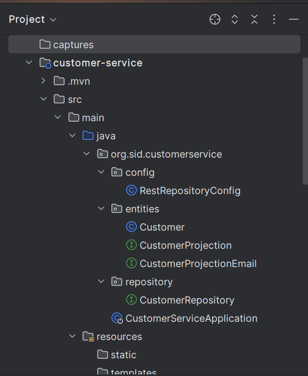
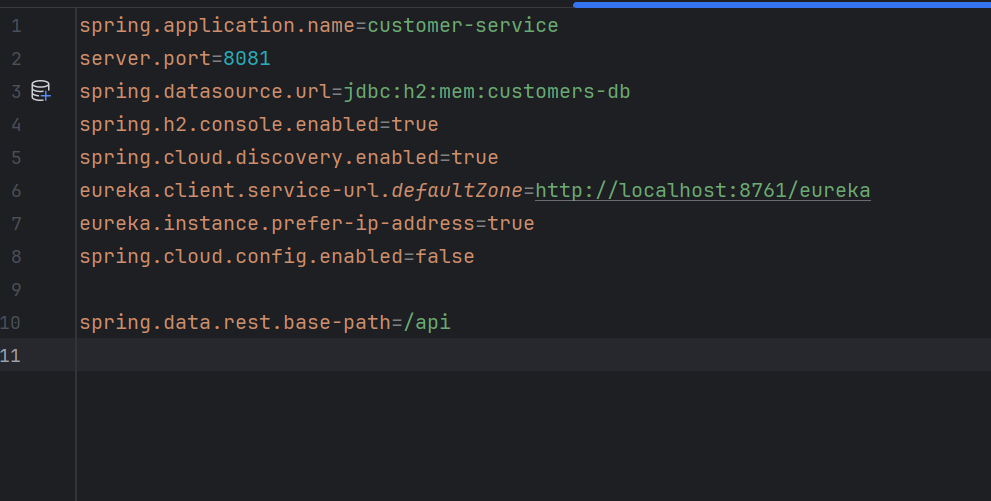
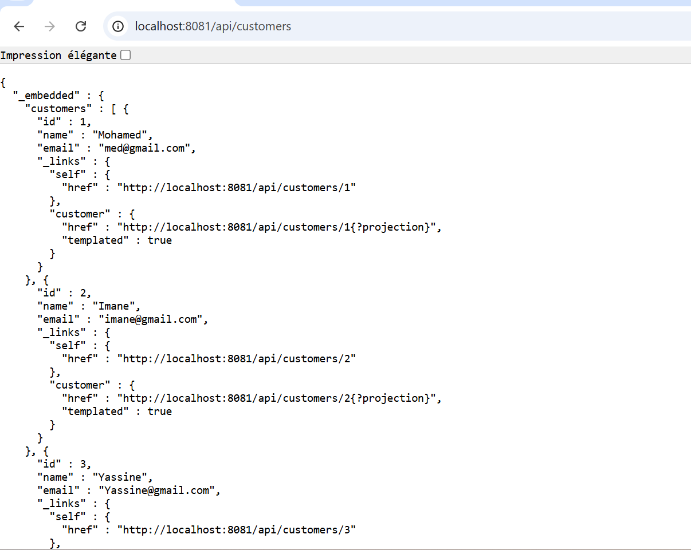
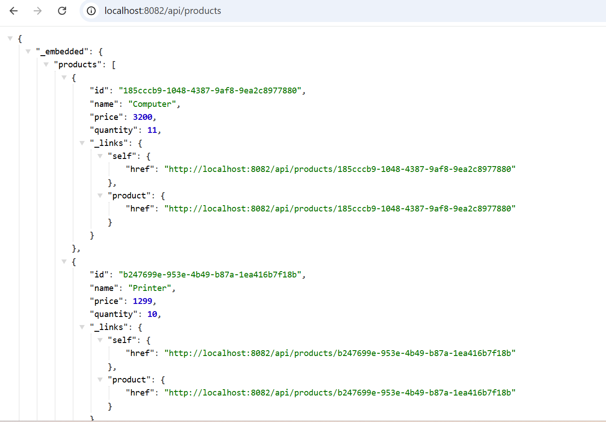
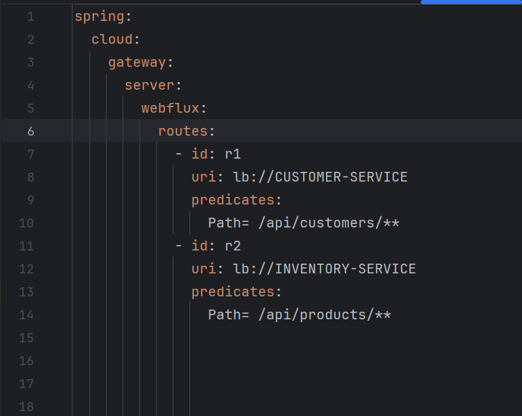
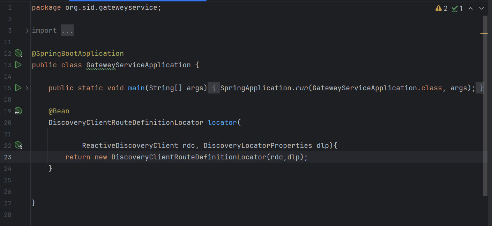
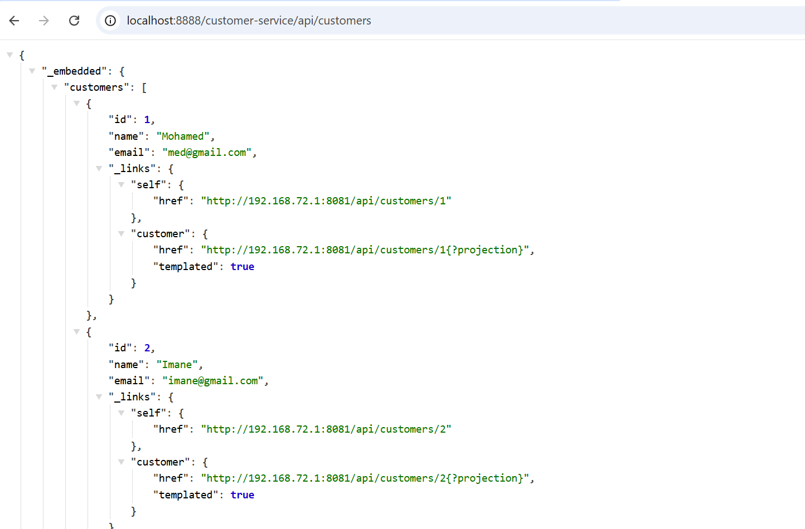
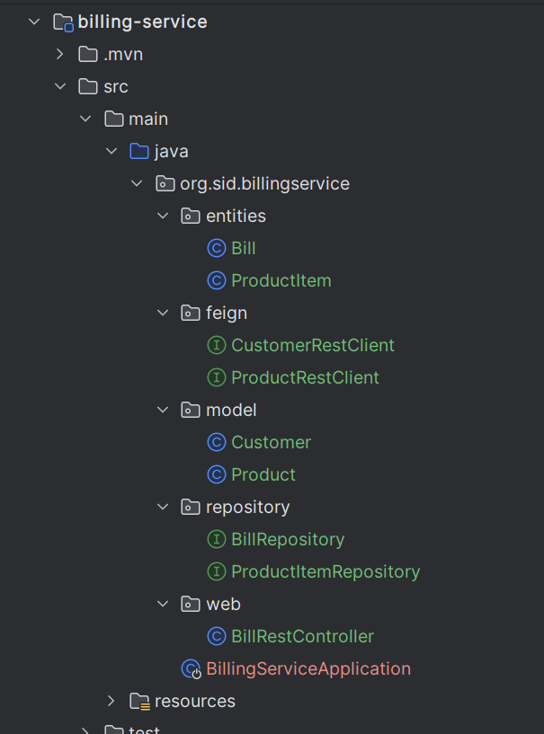
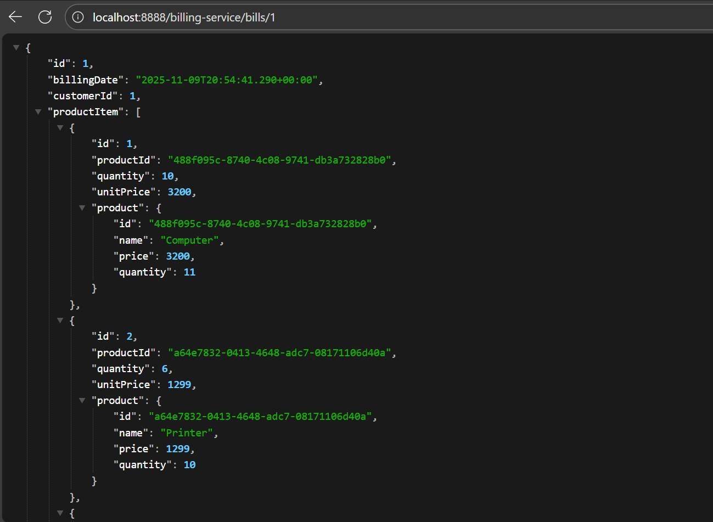

<h2>Partie 1</h2>
<h4>Le micro-service customer-service qui permet de gérer les client</h4>

<h4>le micro-service inventory-service qui permet de gérer les produits</h4>

<h4>la Gateway Spring cloud Gateway</h4>

<h4>Configuration statique du système de routage</h4>

<h4> Faire une configuration dynamique des routes de la gateway</h4>

<h4>le service de facturation Billing-Service en utilisant Open Feign</h4>

